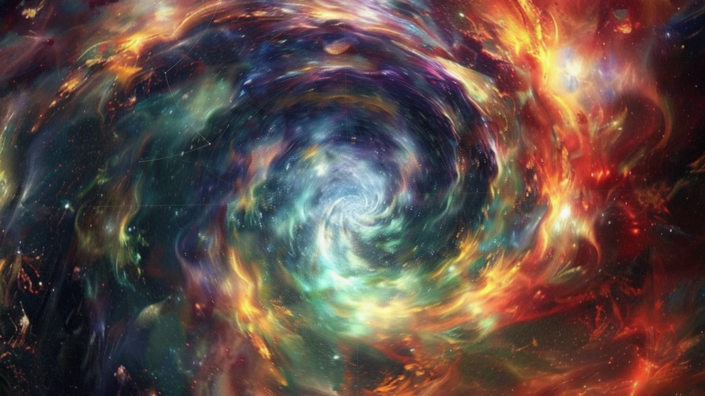
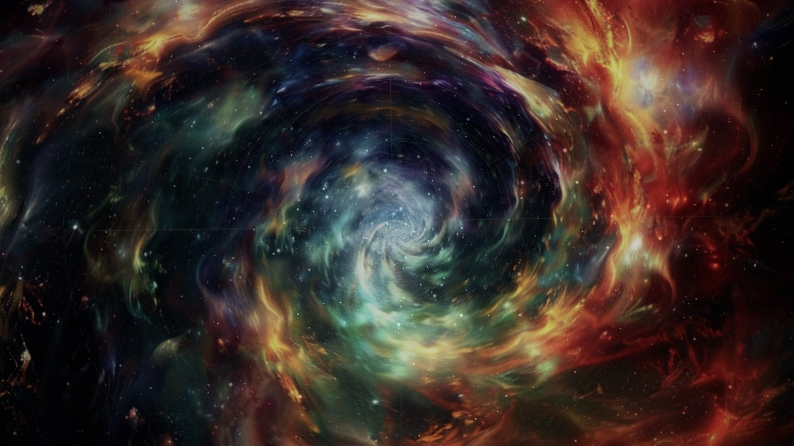
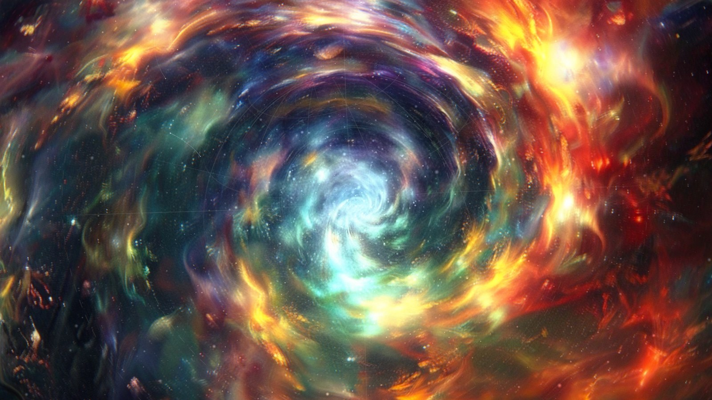
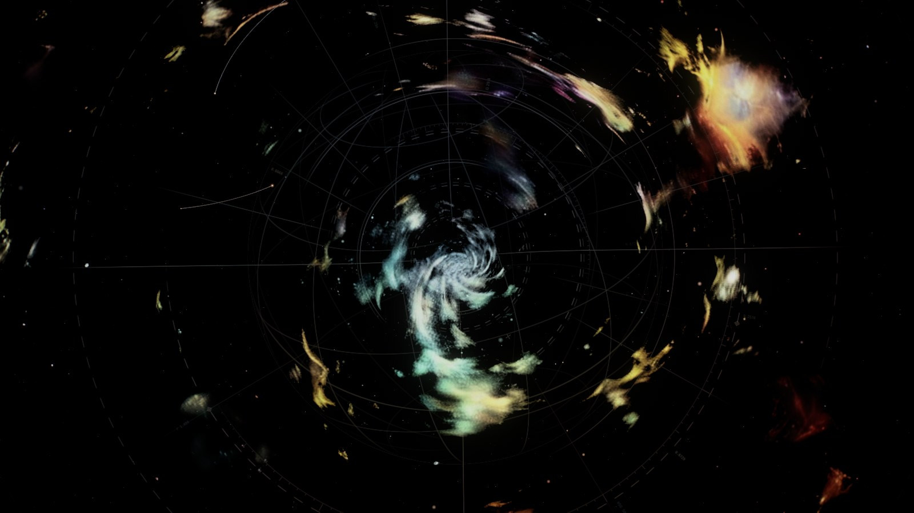
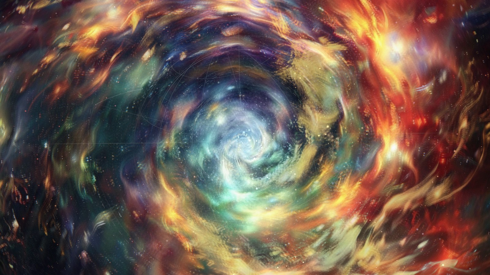
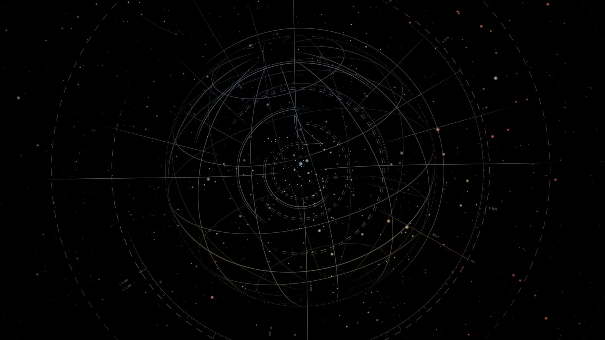

# SOUNDWAVIAN FIELD // GALACTIC MANDALA

A meditative, real-time cosmic screensaver. Three painted galactic vortices are
the substrate; the program keeps them very slowly alive — a differential spiral
flow, a breathing rhythm, drifting star and dust layers in pseudo-3D, and a
barely-visible celestial geometry (orbit arcs, a turning armillary graticule,
coordinate ticks, survey marks, tiny engraved numerals, constellation links)
that surfaces now and then and recedes again.

It's designed to be watched for 20–60 minutes in a dark room, so every effect
is restrained. If something ever feels busy, it's turned down.

| Stillness (default) | Orbit |
| --- | --- |
|  |  |
| **Deep Field** | **Ascension** |
|  |  |
| **Void** | **Transition, midway (B emerging through A)** |
|  |  |

The hidden matrix layer on its own, at about 4× its normal strength:


A 12-second clip is in [`docs/preview.mp4`](docs/preview.mp4). It's rendered
offline with deterministic time steps, so the pacing is real-time.

---

## Quick start (development)

Requirements: Node.js 20+ (22 recommended).

```bash
npm install        # install dependencies
npm run dev        # http://localhost:5173 - live-reloading dev server
npm run build      # type-check, production build to dist/web, offline audit
npm run preview    # serve the production build
```

The web build runs in any modern browser with WebGL 2. It's fully offline:
the paintings, fonts (system fonts only) and all code ship inside the bundle,
and `npm run build` fails if a remote URL or telemetry API gets into it.

Useful URL parameters (development and testing):

| Parameter | Effect |
| --- | --- |
| `?mode=screensaver` | Screensaver behavior: no UI, cursor hidden, any input ends it |
| `?preset=orbit` | Start with a preset (`stillness`, `orbit`, `deep-field`, `ascension`, `void`) |
| `?quality=high` | Pin a quality level (`low`, `medium`, `high`, `ultra`) |
| `?seed=1234` | Fixed seed for reproducible particles, geometry and timing |
| `?debug` | Show the stats overlay (same as **D**) |
| `?capture` | Deterministic offline stepping for screenshots (`window.__advance(seconds)`) |

## Controls

Normal playback shows **no interface at all**. Moving the mouse reveals a
small control panel, which fades again after ~3 s without activity. The cursor
also hides after ~3 s.

| Key | Action |
| --- | --- |
| **Space** | Pause / resume |
| **F** | Toggle fullscreen |
| **→** (Right Arrow) | Next field (begins a 14 s transition; never snaps) |
| **M** | Toggle the matrix layer (fades) |
| **P** | Toggle particles (fades) |
| **R** | Randomize seed (fades out, re-seeds, fades in) |
| **Escape** | Leave fullscreen |
| **1–5** | Presets: Stillness, Orbit, Deep Field, Ascension, Void |
| **D** | Diagnostics overlay: fps, frame time, avg/min fps per preset, quality tier, particle counts, render/display resolution, DPR, GPU, OS, version |
| **C** | Copy diagnostics as plain text to the clipboard (local only; nothing is sent anywhere) |

Panel: **Intensity, Spiral, Matrix, Particles, Breathing, Transition Speed,
Brightness** sliders (multipliers on top of the preset; 1.00 = as designed),
**Pause, Next Field, Fullscreen, Randomize Seed**, quality (Auto/Low/Medium/
High/Ultra) and the Matrix/Particles toggles. Settings persist per user.

In **screensaver mode** (`/s`) any key, click, wheel or real mouse movement
ends the screensaver immediately.

## Presets

| Preset | Character |
| --- | --- |
| **Stillness** (default) | Very slow, minimal particles, almost invisible matrix, weak vortex |
| **Orbit** | Moderate rotating field, visible orbital geometry, balanced particles |
| **Deep Field** | Darkest mode, dense star depth, minimal geometry |
| **Ascension** | Gold/cyan lift in the highlights, stronger breathing, moderate vortex |
| **Void** | Near-black negative space; only fragments of the painting and sparse nodes |

Switching presets eases every parameter over a few seconds. Nothing snaps.

## How it works

```
src/
  main.ts                 entry: installs the screensaver input guard first, then loads the app
  app.ts                  modes, settings, keyboard, render loop
  renderer/
    Scene.ts              owns the renderer and every system; parameter easing, camera drift
    PostFX.ts             HDR target, bloom chain, composite (vignette, CA, grain, dither)
    Quality.ts            GPU-class guess + adaptive quality (steps down on sustained drops)
    uniforms.ts           shared uniforms, additive blend state
  shaders/
    vortex.vert/.frag     SPIRAL FIELD: polar vortex, flow map, FBM warp, emergence transition, grading
    matrix.frag           galactic matrix: arcs, spokes, celestial sphere, ticks, marks (analytic AA)
    particles.*           GPU-only orbital particles (stars, dust)
    nodes.*, links.*      bright nodes and constellation lines
    glyphs.*              engraved numeric markers / glyph sprites
    bloomDown/Up.frag, composite.frag, noise.glsl
  systems/
    TextureField.ts       loads the 3 paintings; painted vortex centre per image
    TransitionEngine.ts   A→B→C→A, 90–180 s holds, 30–60 s transitions, anticipation
    BreathingEngine.ts    ~9–13 s asymmetric breath, wandering period
    ParticleField.ts      star + dust populations
    NodeNetwork.ts        5–15 simultaneous links that fade in, hold, fade out
    MatrixField.ts        matrix pass + glyph atlas (generated locally with Canvas 2D)
  ui/Controls.ts          the auto-hiding panel
  config/presets.ts       ALL animation parameters, presets, quality levels, timing
  platform/               host bridge (browser vs Windows app), settings, screensaver guard
src-tauri/                Windows host (Rust, Tauri 2 / WebView2) - see docs/WINDOWS.md
scripts/                  offline audit, release pipeline, signing wrapper, Windows tests
```

Design notes:

- **Spiral field.** `angle += vortexStrength · falloff(radius) · time`, with a
  smooth non-linear falloff, so the core turns faster than the rim. Running
  that rotation forever would wind the image into noise within minutes, so the
  monotonic part runs through a two-phase *flow map*: two samples whose
  accumulated twist resets half a cycle apart, each faded to zero at its reset.
  Uniform rotation is applied exactly, and a bounded oscillating twist adds
  slow differential motion. After 30+ simulated minutes the painting is still
  coherent.
- **Transitions** aren't crossfades. The incoming painting surfaces first
  through its own brightest structures and a slow noise front, with a faint
  luminous rim and a transient distortion field. About 18 s before a transition,
  dust particles start taking the incoming painting's colors and brighten over
  its bright structures, so you sense the next field before you see it.
- **Colour** comes from the paintings: particles and matrix lines sample the
  (blurred) painting beneath them, with restrained pale-gold / cyan / teal /
  deep-blue / ember accents.
- **Breathing** is one slow signal (≈12 s, wandering ±18%) that moves zoom
  (±1.2%), vortex strength (±5%), bloom (±6%), particle brightness (±7%) and
  matrix visibility (±8%).
- **Camera** drift is a sum of incommensurate sines (periods of 3–13 min):
  0.5–2% zoom, sub-degree roll, ~1% pan. It reverses on its own and never snaps.
- **Determinism.** One seed (shown in the panel) drives particles, nodes, glyph
  labels, transition timings, envelopes and drift phases. Each monitor gets a
  seed derived from it.

### Performance

The target is 60 fps on a reasonably modern Windows PC. Quality levels scale
canvas DPR (capped at 1 / 1 / 1.5 / 2), scene render scale, particle counts
(~1.6k / 4.4k / 8k / 13.6k), FBM octaves (2–5), bloom mip levels (3–6) and
MSAA. **Auto** picks a starting level from the GPU class and the pixel count,
steps down after sustained frame drops, and only probes back up after minutes
of clean frames. All particle motion is computed on the GPU; per-frame CPU work
is limited to ≤64 nodes and ≤16 links.

> Measured so far: the visuals were developed and verified in headless Chromium
> on a software rasteriser (SwiftShader), which says nothing about real-GPU
> frame rates. Real-hardware fps is still to be measured: press **D** on the
> target PC and follow [docs/PHYSICAL_WINDOWS_GATE.md](docs/PHYSICAL_WINDOWS_GATE.md) §6.

## Windows app, screensaver and installer

The Windows build is a small conventional desktop app: a Rust executable using
the system **WebView2** runtime (no bundled Chromium, no Electron), packaged
as a standard **MSI** and a standard **NSIS setup .exe**. The same executable
ships as `SoundwavianField.exe` (Start Menu app) and `SoundwavianField.scr`
(screensaver entry point, supporting `/s`, `/c`, `/p <HWND>`).

```powershell
# on Windows, with Rust (MSVC toolchain) + Node 22 installed
npm ci
npm run release            # DEVELOPMENT build (unsigned) -> dist\release\
npm run release:signed     # SIGNED RELEASE build (needs a real certificate)
npm run app:dev            # run the desktop app against the dev server
```

`dist/release/` then contains:

- `SoundwavianField-Setup-<ver>.exe` (recommended installer) and `SoundwavianField-<ver>.msi` (managed deployment)
- `SoundwavianField.exe` and `SoundwavianField.scr`
- `SHA256SUMS.txt`, `BUILD_INFO.txt`, `README-FIRST.txt` (plain-language install/verify guide)
- `reports/`: `build-info.json`, `defender-scan.txt`, `inspection.txt`, release-test reports and screenshots, and the generated WiX/NSIS installer sources

Full details are in these docs:

- **[docs/WINDOWS.md](docs/WINDOWS.md)**: architecture decision, `.scr` behavior, install and
  uninstall, how to set it as your screensaver, and how to package it later as a Windows `.scr`.
- **[docs/SIGNING.md](docs/SIGNING.md)**: where a real Authenticode certificate is configured.
  It covers DEVELOPMENT vs SIGNED RELEASE builds.
- **[SECURITY.md](SECURITY.md)**: the security review, covering every executable, DLL, process,
  registry key, file location and network endpoint.
- **[docs/RELEASE.md](docs/RELEASE.md)**: the release process and the **release gate** with its current status.
- **[docs/PHYSICAL_WINDOWS_GATE.md](docs/PHYSICAL_WINDOWS_GATE.md)**: the hands-on Windows 10/11 test checklist (non-developer friendly).

### About SmartScreen and antivirus warnings

Even a legitimate, well-behaved Windows app can show a **Windows SmartScreen**
warning ("Windows protected your PC") at first. SmartScreen weighs the
*reputation* of the file and its publisher, and a new file has none:

- **Unsigned builds** (the default development build) will almost always warn
  on other PCs.
- **Code signing doesn't guarantee zero warnings.** A newly issued OV
  certificate also starts with no reputation; warnings fade as the signed files
  get downloaded and run without problems. Since 2024, EV certificates no longer
  bypass this either.
- Reputation accrues to the **publisher certificate and the file hash**. That's
  why this project keeps a stable product name, publisher, identifier and file
  names, and why every release should be signed with the same certificate.

Nothing in this project tries to suppress or bypass SmartScreen or antivirus.
The approach is to be ordinary and transparent: a conventional installer, no
packers, no runtime downloads, no network access, no persistence, and signed
binaries for anything distributed.

## Licence and assets

The three paintings (`public/fields/Galactic_Swirl_*.png`) and the icon derived
from them belong to the publisher; see [LICENSE-ASSETS.txt](LICENSE-ASSETS.txt).
Third-party code: three.js (MIT), Tauri (MIT/Apache-2.0), webgl-noise (MIT).
